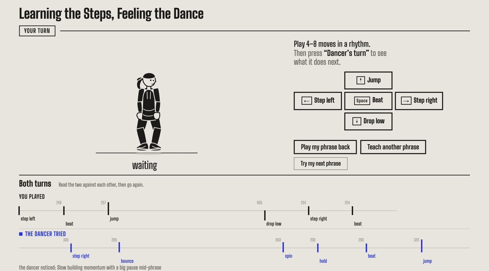

# Learning the Steps, Feeling the Dance

A small web instrument for taking turns with a dancer. Made for ITP's Shared Minds class.

**You teach it a phrase. It answers with one of its own.**

> **Running it needs your own Replicate API token and a few cents of credit** for the
> dancer to take its turn. Without one, you can still teach a phrase and watch it played
> back — the page says so plainly and never invents an answer. See
> [Run it](#run-it) below.



*One real turn.* **Played:** step left · beat · jump · **905 ms pause** · drop low · step
right · beat. **Answered:** step right · bounce · spin — with a **950 ms pause** of its own
before the spin — then hold · beat · jump. Both are drawn at the same scale, so the long
rest in each lines up against the other. Three of the dancer's six moves are ones the
keyboard cannot play.

You play four to eight moves in whatever rhythm you like. Every move is recorded with the
moment you played it, to the millisecond, and the dancer mirrors you as you go. When you
hand the turn over, your phrase — the moves, and the gaps between them — goes to a
language model, which replies with the phrase *it* would dance next. The dancer performs
that on its own, at the model's timing, and both phrases are written out side by side at
the same scale so you can read one against the other.

The question the piece is actually asking is in that gap. A model can find the pattern in
four numbers and answer it plausibly. It cannot know what you were about to do. There is
an optional last step — **Try my next phrase** — where you play what you would really have
danced next, and the two sit beside each other. It is not a score. Nobody was trying to
guess right.

## What you do

Play four to eight moves in a rhythm you like, then press **Dancer's turn**.

Nothing is on a metronome. The instrument records the moment of every key press to the
millisecond, and those gaps *are* the phrase — play it fast, play it lopsided, leave a
rest in the middle. The dancer mirrors each move as you play it, so the keys feel like an
instrument rather than a form.

## The moves

Five are yours, from the keyboard or from the buttons on screen:

| key | move | |
| --- | --- | --- |
| `space` | **beat** | on the spot, nothing travels |
| `←` | **step left** | travels left |
| `→` | **step right** | travels right |
| `↑` | **jump** | leaves the floor and lands |
| `↓` | **drop low** | down into the floor, and stays there |

Three more only the dancer can reach for, so its turn is never only a copy of yours:
**spin** (all the way round), **bounce** (twice, quickly), and **hold** (stay in the shape).

## What the AI does

When you hand the turn over, your phrase is sent to a language model as a list of move
names and the gap in milliseconds before each one — **numbers and words, nothing else**. It
never sees the figure, the page, or you.

It replies with the phrase *it* would dance next: its own moves, at its own timing. The
dancer performs that on its own, and both phrases are drawn one above the other at the same
scale, so the spacing of one can be read against the spacing of the other.

In one real turn, a phrase played *quick, quick, long pause, quick, quick* (gaps of 260,
257, 905, 254, 254 ms) came back as gaps of 300, 280, **950**, 200, 280, 320 — the long
pause reproduced within 45 ms — using three moves the keyboard cannot play. The model's own
note on it was "Slow building momentum with a big pause mid-phrase". That answer took 1.7
seconds to arrive.

The point of the piece is what that does and does not amount to. A model can find the
pattern in six numbers and answer it convincingly. It cannot know what you were about to do
next. **Try my next phrase** is the honest test: you play what you would really have danced,
and it sits beside what the model proposed. It is not scored, because there was nothing to
be right about.

While it is your turn the arrow keys and the space bar belong to the instrument and will
not scroll the page. Between turns they are given back.

## Pauses

A pause is part of a phrase. Leave a second and a half in the middle of your four moves and
that second and a half is recorded, sent, and danced back to you as a rest. Nothing is ever
treated as the end of your turn because you stopped for a moment — after a pause the
hand-over button lights up to *offer*, but only you end the turn.

## Run it

You need Node 20.12 or newer (`node -v`). There is nothing to install: no dependencies,
no build step, no framework.

```bash
git clone https://github.com/cvd9683-gif/shared-minds-learning-the-steps.git
cd learning-the-steps
npm start                     # http://localhost:3000
```

**With no token, teaching still works.** You can play a phrase, watch the dancer mirror it,
and play it back exactly as you danced it. A line under the score says plainly that the
dancer cannot take its own turn on this copy. Nothing is invented to fill the gap: if there
is no model to ask, there is no answer, and the page says so rather than showing you
something that looks like one.

### To let the dancer answer, you need two things

**1. A Replicate API token**, from <https://replicate.com/account/api-tokens>.

```bash
cp .env.example .env          # then open .env and paste your token
npm start                     # restart: .env is only read at startup
```

**2. Credit on that Replicate account.** A token on its own is not enough — an account with
no credit authenticates fine and then refuses every prediction with
`You have insufficient credit to run this model`. Add some at
<https://replicate.com/account/billing>. A turn costs about **$0.001**, so the smallest
top-up covers thousands of them, but it will not run on zero.

If the token is right, starting the server prints:

```
The dancer will answer your phrases using anthropic/claude-4.5-haiku on Replicate
```

If it has picked up a stray character from a bad copy — a line break, or a Cyrillic letter
that looks identical to a Latin one — the server says exactly which position is wrong
instead of failing with an unreadable error from inside `fetch()`. That check exists
because it happened.

The token lives only in `.env`, which is read by the local server and never sent to the
browser. `.env` is listed in `.gitignore`; `.env.example` holds no real token. The server
listens on `127.0.0.1` only, so nobody else on the network can spend your credit.

| `.env` setting | what it does |
| --- | --- |
| `REPLICATE_API_TOKEN` | lets the dancer take its turn; without it everything else still runs |
| `MODEL_CALLS_ENABLED` | set to `false` to stop all new model calls |
| `MAX_CALLS_PER_VISITOR` | turns one visitor may take per window (default 8) |
| `VISITOR_WINDOW_MINUTES` | how long that window is (default 60) |
| `MAX_CALLS_PER_HOUR` | ceiling across everyone (default 40) |
| `MAX_MODEL_CALLS` | hard stop for one run of the process (default 100) |
| `PORT` | which port to serve on (default 3000) |

All of the limits reset when the process restarts — see
[What the limits actually protect](#what-the-limits-actually-protect).

None of this appears on the performance screen. The page tells a visitor what it can and
cannot do in plain words; file names and environment variables live here, and in the
**Development details** panel at the bottom of the page.

Run the tests with `npm test` (they use a stand-in server on localhost and never call Replicate).

## Putting it online (Render)

The piece needs a server, because the API token must never reach the browser. Any Node
host will do; these are the exact settings for a **Render Web Service**.

| Render field | Value |
| --- | --- |
| Repository | `https://github.com/cvd9683-gif/shared-minds-learning-the-steps` |
| Branch | `main` |
| Language / Runtime | **Node** |
| Root Directory | *(leave blank)* |
| Build Command | `npm install` |
| Start Command | `npm start` |
| Instance Type | Free is enough — see the note about sleeping below |

There are no dependencies to install, so the build is near-instant; `npm install` is simply
what Render expects to run. Node 20.12 or newer is required and `package.json` declares it
in `engines`, which Render reads.

### Environment variables to set in the Render dashboard

| Name | Set it to | Why |
| --- | --- | --- |
| `REPLICATE_API_TOKEN` | your token | **Required.** Mark it secret. It stays on the server; the browser is only ever told yes or no. |
| `MODEL_CALLS_ENABLED` | `true`, or `false` to stop | The stop switch. Saving it restarts the service, and the next request is refused. |
| `MAX_CALLS_PER_VISITOR` | `8` | Turns one visitor may take per window. |
| `VISITOR_WINDOW_MINUTES` | `60` | How long that window is. |
| `MAX_CALLS_PER_HOUR` | `40` | Ceiling across everyone. |
| `MAX_MODEL_CALLS` | `100` | Hard stop for one run of the process. |

Everything except the token is optional; the defaults above are what the code uses anyway.

**Do not set `PORT` or `HOST` on Render.** Render sets `PORT` itself and the server reads it.
Render also sets `RENDER`, which is how the server knows to bind `0.0.0.0` instead of
loopback. Setting `PORT` by hand is the usual reason a Node service on Render never passes
its health check.

### Testing the deployed URL

With `https://YOUR-SERVICE.onrender.com` in place of the placeholder:

1. **Is it up and is the token loaded?**
   ```bash
   curl -s https://YOUR-SERVICE.onrender.com/api/status
   # {"dancerCanAnswer":true,"model":"anthropic/claude-4.5-haiku"}
   ```
   `false` means either no token, a token with a stray character in it, or
   `MODEL_CALLS_ENABLED` switched off. The service log says which.
2. **Does the interface load?** Open the URL. You should get the dancer and the five keys.
3. **Does a real turn work?** Play four moves with the arrow keys and the space bar, press
   **Dancer's turn**. Render's log prints one line per turn:
   ```
   [continue] ok    1736 ms   6 moves: step_right, bounce, spin, hold, pulse, jump
   ```
4. **Does the stop switch work?** Set `MODEL_CALLS_ENABLED=false` and save. After the
   restart, `/api/status` reports `dancerCanAnswer: false`, the page says the dancer's turn
   is unavailable, and teaching and replay still work.

The first visit after a quiet spell on the free tier takes 30–60 seconds while Render wakes
the service. Nothing is broken; it is just cold.

## What the limits actually protect

Be clear-eyed about this before handing the link to a class.

**Every counter lives in memory, in one process.** There is no database. That means:

- **A restart resets everything.** Deploys restart. Crashes restart. On the free tier the
  service sleeps after about 15 minutes of no traffic and restarts on the next visit. Each
  restart hands out a fresh `MAX_MODEL_CALLS`, a fresh hourly count, and fresh per-visitor
  counts for everybody.
- **"Per visitor" means per IP address**, taken from the first hop of `X-Forwarded-For`.
  That is friction, not identity. Classmates behind one campus or building NAT may share a
  limit and block each other; the same person on wifi and then on mobile data gets two
  allowances. Anyone who wants to get around it can.
- **If Render ever runs more than one instance**, each has its own counters, and the real
  totals are multiplied by the number of instances.

**What that costs in practice.** A turn is about **$0.001**. While the service stays up,
`MAX_MODEL_CALLS=100` is the binding limit: roughly **10 cents per run**. The hourly
ceiling of 40 works out to about **4 cents an hour** of continuous use. A class of twenty
taking their 8 turns each is about **16 cents**. The uncomfortable case is many restarts
over a long period, since each one starts the budget again.

**So the only limit that cannot be reset by a restart is the one on Replicate's side.**
Before sharing the link, set a spend limit on your Replicate account. The controls in this
repository are there to stop ordinary over-use and accidental double-clicks; they are not a
substitute for a spending cap, and this README would be lying if it said otherwise.

If something goes wrong, `MODEL_CALLS_ENABLED=false` stops new calls within one restart,
and revoking the token at <https://replicate.com/account/api-tokens> stops them immediately.

### Duplicate turns

Pressing **Dancer's turn** twice, or having the page open in two tabs, does not buy two
model calls. The browser refuses to start a second request while one is running, and the
server independently refuses any request from a visitor who already has one in flight,
before it reaches Replicate. Both halves are covered by tests — including one that fires
two handovers simultaneously and asserts exactly one call goes out.

## The model, and what it costs

**`anthropic/claude-4.5-haiku` on Replicate**, called through
`POST /v1/models/anthropic/claude-4.5-haiku/predictions` with the `Prefer: wait` header,
so one HTTP request gets one answer.

Turn-taking is forgiving about latency in a way that dancing along to a live beat is not —
a second or two of thinking between turns is a pause in a conversation, not a mistake. The
page says **Thinking about your phrase…** and keeps your phrase on screen while it waits.
This model is still the right one: it is an official Replicate model so it is always warm,
its input schema is tiny, and it follows a "reply with JSON only" instruction reliably. The
server checks every answer before the dancer is allowed to perform it.

**Size of one turn, measured rather than guessed:** the system prompt is 910 characters and
a four-move phrase adds 186, so about **290 input tokens**; a reply is about **120 output
tokens**. At Anthropic's list price for Haiku 4.5 — $1 per million input tokens, $5 per
million output — that is about **$0.0009 a turn**, under a tenth of a cent, and a session of
thirty turns is around 3 cents.

Replicate shows the current per-token price on the model page itself, and the figures above
could not be read off it automatically (the page renders its pricing in the browser), so
check <https://replicate.com/anthropic/claude-4.5-haiku> before a long session. As a safety
net the server limits how many turns one visitor may take, how many everyone may take in an
hour, and how many one run of the process may make at all. None of that survives a restart,
which is why [What the limits actually protect](#what-the-limits-actually-protect) asks you
to set a spend limit on Replicate as well.

**Verified schema.** The model is at version `1ad171f6…` and takes exactly three inputs:
`prompt`, `system_prompt`, and `max_tokens` (minimum 1, maximum 8192, default 8192). This
project sends all three, with `max_tokens: 1024`.

## What the model actually receives

Move names and milliseconds. Nothing else:

```
The person danced 5 moves over 2922 ms:
  step_left
  435 ms later: pulse
  410 ms later: jump
  1608 ms later: step_right
  469 ms later: drop
Gaps between their moves: 435, 410, 1608, 469 ms.
Now dance your turn.
```

It never sees the figure, the page, or you. It answers with JSON like
`{"read": "steady, then a long rest", "moves": [{"after_ms": 450, "move": "spin"}, …]}`,
where `after_ms` on the first move is the gap it leaves before starting.

## How the turn stays honest

- The dancer's turn is danced only from an answer that actually arrived and passed
  checking: 2 to 10 moves, every gap between 60 and 4000 ms, every move one it can perform.
  A reply that fails any of that is reported as a failure, with the model's own words kept
  in the log. There is no fallback that stands in for the model.
- With no token, no request is made and the page says the dancer cannot answer yet.
- Your phrase is never edited to fit. The gaps that go out are the gaps you played.
- The comparison is labelled as what it is: the model proposed a continuation without
  knowing your intention. The page reports how the two differ — how many moves match, and
  how the pace compares — and says outright that neither is the right answer.
- If the API fails, your phrase is still there and can still be played back.

Open **Development details** on the page for the request log: what was sent, what came
back, how long it took. Two test switches there make an answer arrive four seconds late, or
make requests fail, so both can be seen without waiting for a bad network.

The terminal running `npm start` also prints one line per turn, which is the quickest place
to diagnose a failure:

```
[continue] ok    1180 ms   5 moves: spin, step_right, jump, bounce, hold
[continue] FAILED 502 after 640 ms — Replicate refused the request: Insufficient credit.
```

| what the line says | what it means |
| --- | --- |
| `FAILED 500 … no model configured` | the server started without a token — check `.env`, then restart it |
| `FAILED 502 … Replicate refused the request: …` | the token reached Replicate and it said no; the reason is quoted (bad token, no credit, model not available to your account) |
| `FAILED 502 … Could not reach Replicate` | no network, or a firewall between you and `api.replicate.com` |
| `FAILED 502 … not one of the dancer's moves` | the call worked; the model's answer failed checking. The reply is kept in the page's request log |
| `FAILED 429 …` | the per-run call limit, or more than one call a second |

It never prints the token, and never prints the prompt.

## Files

| file | what it does |
| --- | --- |
| `server.js` | serves `public/`, routes `/api/continue`, holds the token |
| `phrase-api.js` | builds the prompt, calls Replicate, checks the answer is danceable |
| `limits.js` | who may ask for a turn and how often, and the stop switch (no DOM, tested) |
| `public/js/phrase.js` | the moves, reading a phrase, checking a continuation (no DOM, tested) |
| `public/js/main.js` | the state machine: teaching, thinking, the dancer's turn, and after |
| `public/js/input.js` | the five keys and the five buttons |
| `public/js/dancer.js` | the figure: a jointed rig, its eight moves, and the groove between them |
| `public/js/player.js` | playing a phrase back in the rhythm it was recorded in |
| `public/js/score.js` | writing a phrase down so two can be read against each other |
| `public/js/log.js` | the request log under "Development details" |
| `public/pose.html` | a scratch page that draws the figure in each pose, for working on the drawing |
| `test/` | `phrase`, `limits` and `server` suites — none of them call Replicate |

`public/pose.html` takes `?moves=jump@0.5,drop@0.85` — a move, and optionally how far
through it to freeze — which is the quickest way to look at an animation you are changing.

## How the dancer moves

The body is a rig with hips, knees, ankles, spine, shoulders, elbows and neck. The feet are
placed on the floor and the knees are solved from where the hips are, so shifting weight and
squatting bend the knees on their own. How far the knees are allowed to open sideways rises
with how low the hips are: standing, a bent knee travels forward rather than out, and
solving it flat makes the figure bow-legged; in a deep drop the knees really do open.

Four layers stack up: a breath that never stops, so the figure is alive before anything
happens; a groove timed to the phrase; a move that snaps to an accent and then settles; and
steps, jumps, spins, elbow lag and the ponytail on their own clocks. The forearm trails the
upper arm, which is what makes an arm read as having weight rather than being a stick.

**Every move is handed the span it has before the next one**, so nothing plays at a fixed
tempo — the same jump is quick in a fast phrase and drawn out in a slow one, and a rest you
left is danced as a rest. While a phrase is playing the dancer is also told when the next
move is due, so the groove's lift arrives just before it rather than after.

A jump gathers, leaves the floor on an arc with the knees tucking under, and absorbs the
landing through the knees, with the shadow shrinking and fading underneath. A drop travels
the hips a long way down and stays there until something asks otherwise. A spin goes all the
way round through the figure's narrow side, arms pulled in, head leading.
